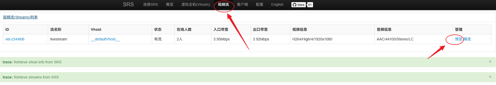

# WebRTC

## 前言

WebRTC（Web Real-Time Communications）是一项实时通讯技术，它允许网络应用或者站点，在不借助中间媒介的情况下，建立浏览器之间点对点（Peer-to-Peer）的连接，实现视频流和（或）音频流或者其他任意数据的传输。WebRTC 包含的这些标准使用户在无需安装任何插件或者第三方的软件的情况下，创建点对点（Peer-to-Peer）的数据分享和电话会议成为可能。


## 协议

### ICE

WebRTC 连接是在 **ICE 协议框架**的基础之上建立的。ICE（Interactive Connectivity Establishment，交互式连接创建）是一个允许你的浏览器和对端浏览器建立连接的协议框架。<br />

在实际的网络当中，有很多原因能导致简单的从 A 端到 B 端直连不能如愿完成。这需要绕过阻止建立连接的防火墙，给你的设备分配一个唯一可见的地址（通常情况下我们的大部分设备没有一个固定的公网地址），如果路由器不允许主机直连，还得通过一台服务器（TURN）转发数据。

ICE 协议框架通过使用以下几种技术完成上述工作：

* NAT
* STUN
* TURN
* SDP
  
  

### NAT

NAT（Network Address Translation，网络地址转换协议）用来给你的（私网）设备映射一个公网的 IP 地址的协议。一般情况下，路由器的 WAN 口有一个公网 IP，所有连接这个路由器 LAN 口的设备会分配一个私有网段的 IP 地址（例如 192.168.1.3）。私网设备的 IP 被映射成路由器的公网 IP 和唯一的端口，通过这种方式不需要为每一个私网设备分配不同的公网 IP，但是依然能被外网设备发现。


### STUN

STUN（Session Traversal Utilities for NAT，NAT 的会话穿越功能 ），是一个允许位于 NAT 后的客户端找出自己的公网地址，判断出路由器阻止直连的限制方法的协议。<br />

客户端通过给公网的 STUN 服务器发送请求获得自己的公网地址信息，以及是否能够被（穿过路由器）访问。<br />


一些路由器严格地限定了谁能连接内网的设备。这种情况下，即使 STUN 服务器识别了该内网设备的公网 IP 和端口的映射，依然无法和这个内网设备建立连接。这种情况下就需要转向 TURN 协议。


### TURN

一些路由器使用一种“对称型 NAT”的 NAT 模型。这意味着路由器只接受和对端先前建立的连接（就是下一次请求建立新的连接映射）。<br />

TURN（Traversal Using Relays around NAT，NAT 的中继穿越方式）通过 TURN 服务器中继所有数据的方式来绕过“对称型 NAT”。你需要在 TURN 服务器上创建一个连接，然后告诉所有对端设备发包到服务器上，TURN 服务器再把包转发给你。这种方式是开销很大的，所以只有在没得选择的情况下采用。<br />


### SDP

SDP（Session Description Protocol，会话描述协议），是一个描述多媒体连接内容的协议，例如分辨率，格式，编码，加密算法等。所以在数据传输时两端都能够理解彼此的数据。本质上，这些描述内容的元数据并不是媒体流本身。从技术上讲，SDP 并不是一个真正的协议，而是一种数据格式，用于描述在设备之间共享媒体的连接。


SDP 由一行或多行 UTF-8 文本组成，每行以一个字符的类型开头，后跟等号（“ =”），然后是包含值或描述的结构化文本，其格式取决于类型。以给定字母开头的文本行通常称为“字母行”。例如，提供媒体描述的行的类型为“m”，因此这些行称为“m 行”。


```
v=0
o=- 2730762382602303627 2 IN IP4 127.0.0.1
s=-
t=0 0
a=group:BUNDLE 0 1
a=extmap-allow-mixed
a=msid-semantic: WMS ba71af70-9222-4a83-a780-946afd868aa9
m=video 9 UDP/TLS/RTP/SAVPF 96 97 102 103 104 105 106 107 108 109 127 125 39 40 98 99 100 101 112 113 116 117 118
c=IN IP4 0.0.0.0
a=rtcp:9 IN IP4 0.0.0.0
a=ice-ufrag:M1il
a=ice-pwd:nh3sQuqokikxlyvF4J42CcXk
a=ice-options:trickle
a=fingerprint:sha-256 E2:66:65:48:16:0A:38:29:A1:5C:CB:5D:7C:FF:89:93:2A:A2:68:6E:44:6B:52:94:01:35:E8:A4:CD:53:51:B9
a=setup:actpass
a=mid:0
a=extmap:1 urn:ietf:params:rtp-hdrext:toffset
a=extmap:2 http://www.webrtc.org/experiments/rtp-hdrext/abs-send-time
a=extmap:3 urn:3gpp:video-orientation
a=extmap:4 http://www.ietf.org/id/draft-holmer-rmcat-transport-wide-cc-extensions-01
```


## 信令服务器

> Signaling Server

**实现一**： nodejs + socket.io

参考

* https://developer.mozilla.org/zh-CN/docs/Web/API/WebRTC_API/Signaling_and_video_calling

* https://zhuanlan.zhihu.com/p/617493984

* https://juejin.cn/post/7171089420911640613
  
  

**实现二**：springboot + websocket 或者 netty + websocket


## 穿透服务器

### STUN 服务器

> https://zhuanlan.zhihu.com/p/571855011


### TURN 服务器

> https://zhuanlan.zhihu.com/p/71025431
> 
> https://zhuanlan.zhihu.com/p/571855011


**coturn**： https://github.com/coturn/coturn


## SFU 转发服务器

> Selective Forwarding Unit

* [为什么需要 SFU 服务器](https://zhuanlan.zhihu.com/p/449126409)
* [如何实现 SFU 服务器](https://zhuanlan.zhihu.com/p/68500274)
  
  

SFU 服务器：

* janus-gateway

* mediasoup

* Licode

* Jitsi

* Medooze

* ossrs
  
  

## Janus-gateway

> [Github](https://github.com/meetecho/janus-gateway)，[官网](https://janus.conf.meetecho.com/)，[第三方 docker](https://github.com/wangsrGit119/janus-webrtc-gateway-docker)

> 搭建起来还是有点麻烦的，注意看好配置文件的映射和启用的插件情况

```shell
# 在 docker-compose.yaml 同目录下
docker compose logs -f # 用来查看 docker compose 日志比 docker logs -f <container-name> 方便
```


> [JavaScript API](https://janus.conf.meetecho.com/docs/JS.html)

> 初步感受：比使用纯 WebRTC 复杂


**踩坑**：

* `videoCallPluginHandle.createOffer#tracks`
  
  > `tracks:` you can use this property to tell the library which media (audio/video/data) you're interested in, and whether you're going to send and/or receive any of them; by default no device is captured, and Data Channels are disabled as well; incoming audio and video is instead autoaccepted unless you tell the library otherwose; the same property can also be used to update sessions (e.g., to add/remove/replace tracks); this option is an array of objects, where each object can take any of the following properties:

* `videoCallPluginHandle#data`
  
  ```js
      const sendToDataChannel = param => {
          console.log(param)
          // 使用 dataChannel 发送消息的时候注意 videoCallPluginHandle.data 方法参数需要以对象的形式传入，并且参数名只能叫 text 或者 data
          // data(parameters): sends data through the Data Channel, if available;
          videoCallPluginHandle.data({
              data: param
          })
      }
  ```
  
  
  
  

理了一段时间，终于通了。整理以下思路：


### 启动服务

1、[Docker](https://github.com/canyanio/janus-gateway-docker)

2、[获取配置文件](https://github.com/meetecho/janus-gateway)

3、配置文件中路径重命名

```
## 新版本中下面这几个路径在配置文件中是 @xxx@ 变量赋值，改成下面的
configs_folder = "/usr/local/etc/janus"                        
plugins_folder = "/usr/local/lib/janus/plugins"                   
transports_folder = "/usr/local/lib/janus/transports"     
events_folder = "/usr/local/lib/janus/events"                    
loggers_folder = "/usr/local/lib/janus/loggers"
```

4、启动 docker-compose


### SFU

> use janus as a sfu

#### P2P


1、引入依赖 `janus.js` 和  `webrtc-adapter`。前者可以使用 CDN 或者直接复制到本地，后者使用 `npm install`

2、初始化 Janus

```js
    let janusInst = null  
  let videoCallPluginHandle = null;
    function initJanus () {
        janus.init({
            debug: true,
            dependencies: Janus.useDefaultDependencies({ adapter: adapter }), // must be here
        })

        janusInst = new Janus({
            server: 'http://localhost:8088/janus', // your janus server
            success: () => {
                initPluginHandle(); // 初始化 janus 成功后初始化插件
            },
            error: err => {},
            destroy: () => {}
        })
    }
```

3、初始化插件

```js
    const [clientId, setClientId] = useState('');
    const initPluginHandle = () => {
        // client unique Id
        const randomId = Janus.randomString(8);
        setClientId(randomId)

        janusInst.attach({
            opaqueId: clientId,
            plugin: 'janus.plugin.videocall', // 设置需要的插件
            success: pluginHandle => {
                videoCallPluginHandle = pluginHandle
            },
            error: (cause) => {},
            onmessage: (msg, jsep) => {
                // msg 交互信息：create/join/stop
                // jsep：协商信令
                onMessage(msg, jsep)
            },
            ondata: data => { // data has been received through the Data Channel;
            },
            onlocaltrack: (track, added) => {},
            onremotetrack: (track, mid, added) => {},
            oncleanup: () => {},
            detach: () => {}
        })
    }
```

4、经过以上步骤 janus 初始化完毕，接下来注册用户

```js
    const registerToJanus = () => {
        const register = {
            request: 'register', // 还有 call/accept 等请求，janus 会根据请求处理不同的操作
            username: clientId
        }

        videoCallPluginHandle.send({message: regiientId)
    }
```

5、发起呼叫请求（创建 Offer）

```js
    const createOffer = () => {
        videoCallPluginHandle.createOffer({
            // video + audio + datachannel
            tracks: [
                {
                    type: 'screen', // must be one of "audio", "video", "screen" and "data";
                    // capture: in case something must be captured (e.g., a microphone for "audio" or a "webcam" for video),
                    // passing true asks for the default device,
                    // but getUserMedia (for audio/video) or getDisplayMedia (for screen sharing) constraints can be passed as well as objects
                    capture: navigator.mediaDevices.getDisplayMedia({video: true, audio: false}),
                },
                { type: 'data' }
            ],
            success: jsep => {
                const body = {
                    request: 'call',
                    username: targetId
                }

                videoCallPluginHandle.send({
                    message: body,
                    jsep
                })
            },
            error: cause => {}
        })
    }
```

6、offer 请求发送后可以在 `janusInst.attach#onmessage` 回调函数中接收到消息，可以在里面根据消息类型进行不同操作的处理

```js
    const onMessage = (msg, jsep) => {
        console.log('::: Received Message :::')
        console.log(msg)
        const result = msg['result']
        if (result) {

            let event = null;
            if (event = result.event) {
                switch (event) {
                    case 'incomingcall':
                        createAnswer(jsep)
                        break;
                    case 'accepted':
                        onAccepted(jsep)
                        break;
                    case 'update':
                        break;
                    case 'hangup':
                        break;
                    default:
                        break;
                }
            }
        }
    }
```

7、目标用户接收到 Offer，创建 Answer

```js
    const createAnswer = (jsep) => {
        videoCallPluginHandle.createAnswer({
            jsep,
            tracks: [
                {
                    type: 'screen',
                    capture: navigator.mediaDevices.getDisplayMedia({video: true, audio: false}),
                },
                { type: 'data' }
            ],
            success: innerJsep => {
                const body = {
                    request: 'accept'
                }
                videoCallPluginHandle.send({
                    message: body,
                    jsep: innerJsep
                })
            },
            error: err => {
                console.log('createAnswer error: ', err)
            }
        })
    }
```

8、最后双方都会接收到 accept 指令，通话开始

```js
    const onAccepted = (jsep) => {
        console.log('onAccepted jsep: ', jsep)
        if (jsep) {
            videoCallPluginHandle.handleRemoteJsep({
                jsep
            })
        }
    }
```


#### PtoMany

> 调了很久，PtoMany 终于通了。遇到一个坑：在 WSL 中的 Ubuntu 安装 Docker 再启动 Janus 的话在使用 `videoroom` 的时候会导致无法启动 ICE Server 无法启动；测试 `videocall` 的时候却是没问题的。


**流程和 P2P 有差别**：

1、无需发送 register 请求，直接 join room 就会生成唯一 id；后续可以使用这个唯一的 id 进行视频流的发布和订阅操作。

2、createOffer 和 createAnswer 操作是分开的，由两个不同的 pluginHandle 分别执行。publisher 的 pluginHandle 负责 createOffer；subscriber 的 pluginHandle 负责 createAnswer。publisher 和 subscriber 都是和 Janus 服务器进行交流的，不像 P2P 直接进行交流。


**关于发布与订阅逻辑**

当前的代码逻辑将发布和订阅耦合在了一起，是为了达到既能发布也能订阅这一操作。如果想要将这两个角色解耦，可以修改一下订阅的逻辑：输入 roomId 之后先 listParticipants，选择对应的 publisher 之后再带着 publisherId 进行 join 操作。


### rtc_forward

Janus 还提供 *RTP forwarding* 操作。forward 的使用场景：比如说存在多个 rtsp/rtmp 的服务器，可以将当前流媒体服务器中的任何一路流转发到其他服务器，其他服务器收到该流后再进行分发，可以实现集群的容灾。

```js
const doForward = () => {
    const streams = []
    publishStreams.forEach(stream => {
        if (stream.type === 'video') {
            const readyToPush = {
                port: 4567,
                rtcp_port: 4568,
                mid: stream.mid
            }
            streams.push(readyToPush)
        }
    })
    const message = {
        request: 'rtp_forward',
        room: roomId,
        publisher_id: clientId,
        secret: 'adminpwd',
        host: '127.0.0.1',
        host_family: 'ipv4',
        streams
    }

    videoRoomPluginHandle.send({
        message,
        success: resp => {
            console.log(resp)
        }
    })
}
```


## SRS

> [OS SRS 官网](https://ossrs.net/lts/zh-cn/)
> 
> [Github 主页](https://github.com/ossrs/srs.git)

SRS（Simple Realtime Server）是一个简单高效的实时视频服务器，支持 RTMP、WebRTC、HLS、HTTP-FLV、SRT 等多种实时流媒体协议。

> srs 提供 源码编译、docker、k8s 支持。

### 架构


加入 SRS 服务之后整个架构流程如上图所示，目前暂时先不考虑存储，我们只需要关注架构中的上面那一层。媒体流从 Live Streaming Clients => SRS Server => WebRTC Clients。


### SFU

> srs 也可以当作 sfu 来使用

* P2P

* PtoMany


### RTMP 推流

#### RTMP 推流步骤

1、首先从 github 上拉取项目，我们需要其中的配置文件

2、拉取镜像

`docker pull ossrs/srs`

3、启动 srs 服务

```shell
# --rm 参数有点“阅后即焚”的意思，停止即删除容器
# 指定使用 docker.conf 配置文件来启动
docker run --name=srs -d --rm -it -p 1935:1935 -p 1985:1985 -p 8080:8080 ossrs/srs:latest ./objs/srs -c conf/docker.conf
```

4、安装 ffmpeg，[ffmpeg 下载](https://ffmpeg.org/download.html)。注意：官方版本的 ffmpeg 不支持 hevc 格式的视频，需要手动添加依赖并重新编译，参考：https://github.com/runner365/ffmpeg_rtmp_h265

5、使用 ffmpeg 命令，将本地媒体文件推流至 srs 服务器

```bash
ffmpeg -re -i ./input.flv -c copy -f flv rtmp://localhost/live/livestream
# 加上参数 -stream_loop -1 表示循环推送
ffmpeg -re -stream_loop -1 -i input.flv -c copy -f flv rtmp://localhost/live/livestream

# 推流成功后可以尝试使用 ffmpeg 拉流
ffplay rtmp://localhost/live/livestream
```

5.1、如果输入流为 RTMP 链接，也可以使用 ffmpeg 来实现推流

```bash
ffmpeg -re -stream_loop -1 -i rtmp://somewhere/live/livestream -c copy -f flv rtmp://localhost/live/repush
```

6、打开 `http://localhost:8080/`，进入 srs 控制台，连接 srs


7、点击视频流，并预览



8、播放视频


9、如果配置文件中开启了 rtmp2rtc 支持，还可以选择以 WebRTC 的形式预览（如果使用域名无法播放，尝试使用 IP 来播放）


#### 踩坑

1、rtmp to webrtc

在使用 docker 运行的时候，命令如下

```bash
docker run --rm --name=srs -it -p 1935:1935 -p 1985:1985 -p 8080:8080 -p 1990:1990 -p 8088:8088 -d -p 8000:8000/udp --env CANDIDATE=192.168.2.201 ossrs/srs:latest ./objs/srs -c conf/docker.conf
```

注意看：

* 使用 RTC 播放，在点击播放视频之后需要等几秒钟才有画面显示。

* 命令行中指定的 `CANDIDATE` 需要是本机的 IP 或者服务器的公网 IP；如果使用域名无法进行播放，尝试将连接修改成 `CANDIDATE` 中指定的 IP。

* 还要注意指定的配置文件中是否开启了 `rtmp_to_rtc` 或者 `rtc_to_rtmp` 支持（需要 `4.x` 版本以上才支持）。
  
  ```
  rtc {
      enabled on;
      # @see https://ossrs.net/lts/zh-cn/docs/v4/doc/webrtc#rtmp-to-rtc
      rtmp_to_rtc on;
      # @see https://ossrs.net/lts/zh-cn/docs/v4/doc/webrtc#rtc-to-rtmp
      rtc_to_rtmp on;
  }
  ```
  
* 调试的时候又发现了一个坑：基于 chromium 的 edge 使用 rtc 播放器可能无法播放，需要使用 chrome

* 也可能是 SRS 播放器链接协议的问题，在没有启动 httpx-static 服务的情况下，注意播放器的连接需要是 http 协议：http://localhost/players/rtc_player.html

<br />


### WebRTC 推流


#### RTC 推流步骤

0、引入依赖 `srs.sdk.js` 和 `srs.sig.js`

```js
// srs.sdk.js
export {
    SrsRtcPublisherAsync,
    SrsRtcPlayerAsync
}

// srs.sig.js
export {
    SrsRtcSignalingAsync,
    SrsRtcSignalingParse
}
```

1、链接到信令服务器，并初始化

```js
const connectSignaling = async (wsSchema, host, port, roomId, clientId) => {
    console.log('connectSignaling')
    sig = new SrsRtcSignalingAsync()
    initSig(sig)

    // wsSchema = ws|wss
    // host = <signaling-server-ip>
    // const wsUrl = wsSchema + '://' + host + ':' + port + '/sig/v1/rtc?room=' + roomId  + '&display='+ clientId
    const srsUrl = host + ':' + port
    setSrs(srsUrl)
    await sig.connect(wsSchema, srsUrl, roomId, clientId)
}

const initSig = (sig) => {
    console.log('init Signaling')
    sig.onmessage = data => {
        if (data) onSignalingMessage(data)
    }
}
```

2、加入房间

```js
const join = async () => {
    let resp = await sig.send({action: 'join', room: room, display: client});
    console.log('signaling join ok ', resp)

/*
返回的消息格式如下
{
    "action": "join",
    "room": "1234",
    "self": {
        "display": "0vXBkT",
        "publishing": false
    },
    "participants": [{
    	"display": "0vXBkT",
        "publishing": false
    }]
}
*/
}
```

3、发布（推流）到 srs 服务器

```js
const publish = async () => {
    await startPublish('localhost', room, client)
    sig.send({
        action: 'publish',
        room: room,
        display: client
    })
}

const startPublish = (host, room, display) => {
    const url = 'webrtc://' + host + '/' + room + '/' + display
    if (publisher) {
        publisher.close()
    }

    publisher = SrsRtcPublisherAsync()
    console.log('publisher ', publisher)
    const publisherVideoDom = document.getElementById('publishVideo')
    setStream(publisherVideoDom, publisher.stream)

    return publisher.publish(url).then(resp => {
        console.log('publish success ', resp)
        console.log('self url ', url)
        setSelfUrl(url)
    })
}

const setStream = (dom, stream) => {
    if (stream) dom.srcObject = stream
}
```

4、查看控制台显示有流，即表示推流成功


5、接下来可以使用 webrtc://localhost/room/clientId 拉流播放


#### 踩坑

* 原先在 docker 中运行 ossrs 然后使用 WebRTC 推流，查看控制台的时候发现该链接显示无流，但推流步骤都是正确的，百思不得其解。随后从 docker 运行改成自编译 ossrs 运行，配置文件中开启 rtc 相关配置，控制台显示推流成功。
* SRS 播放器默认打开 http://localhost/room/streamId.flv 可能会有点卡顿，可以使用 RTC 播放器。但 RTC 播放器可能会出现黑屏，可以切换到 Chrome 浏览器。RTC 播放器的原始播放链接类似：webrtc://localhost/room/streamId.flv，可以尝试修改成 webrtc://<Your-IP>/room/stream。


### RTMP 低延迟配置

> 参考：http://ossrs.net/lts/zh-cn/docs/v4/doc/sample-realtime


### Forward 转发

> 可以参考文档：[Forward 部署](https://ossrs.net/lts/zh-cn/docs/v4/doc/sample-forward) 进行配置


### 关于 http 和 webrtc 的流畅度

RTMP 推流到 SRS 使用 WebRTC 播放是常见的用法，RTMP 是 30 帧，WebRTC 只有 10 帧，看起来就会卡顿不流畅。

> ossrs 官方有一个排查[方法说明](https://ossrs.net/lts/zh-cn/docs/v4/tutorial/srs-faq)


看到一个 http 和 webrtc 流畅度的 [github issue](https://github.com/ossrs/srs/issues/2484) 讨论，总结如下：

> RTC 主要是 100 毫秒左右的延迟，用于通话，交流场景。由于延迟很低，所以很多技术点是不同的，第一次看到的画面肯定比直播要慢一些，卡顿率也肯定会上升一些。
> 
> 用 RTC 做直播，一般延迟会在 800 毫秒左右。比 RTC 延迟大，比直播（协议）的延迟低。相对比较均衡，目前阿里 RTC 和腾讯快直播都是这种类型。但是，和直播（协议）相比，肯定也会有点点细微差异。
> 
> 直播（协议）首屏快，延迟 3 秒左右，卡顿率低很流畅。但是 WebRTC 为什么延迟低了会卡？
> 
> 1、首屏：打开就能看，直播 > 低延迟直播 > RTC；
> 
> 2、流畅度：播放过程不卡，直播 > 低延迟直播 > RTC；
> 
> 3、低延迟：能通话，RTC > 低延迟直播 > 直播


## Janus 与 SRS 对比

> 引用：https://github.com/ossrs/srs/issues/2296

Janus 的优势：

- 支持 Video Call，能在其基础上快速实现一对一通话。专门的信令，提供信令说明文档。
- 支持 Video Room，能在其基础上快速开放音视频会议。
- 支持 Audio Room(audiobridge)，服务器对各个客户端的音频进行混音后再转发，能降低客户端流量，提升弱网体验。在需要纯语音的场景用的比较多，比如有同事将其应用在游戏喊麦、三方语音客服等领域
- 支持录制和回放
- Android、IOS、Web、Window 客户端参考 DEMO。
- 支持插件开发( Video Room、Audio Room 等)

总结：Janus 能够提供常见场景的解决方案，且各个客户端有可以参考的代码，能够快速实现 demo 的搭建。

Janus 的弊端：

- 原生不支持级联，单机接入量也有限。
- 使用 glib 库，导致学习源码成本较高。
- 不支持 Web 直播推流接入。


## 使用 Java 将视频流推送到 SRS

1、确保本地安装了 ffmpeg 环境，或者将 ffmpeg 放入 Java 程序的 resource 目录。

2、使用 StringBuilder 来拼接 ffmpeg 命令。

3、使用 `Runtime.getRuntime().exec()` 来运行 ffmpeg 命令

```java
// 1、在实际的生产环境中还需考虑是否需要开启多线程的情况
// 2、目前在测试中发现只进行推流操作应用占用的内存有 40 mb 左右
Process process;
StringBuilder command = new StringBuilder("ffmpeg ");
command.append("-re ");
command.append("-stream_loop -1 ");
command.append("-i input.flv ");
command.append("-c copy ");
command.append("-f flv ");
command.append("rtmp://localhost/live/livestream");
process = Runtime.getRuntime().exec(command.toString());
BufferedReader buffer = new BufferedReader(new InputStreamReader(process.getErrorStream()));
String line = null;
while ( null != (line = buffer.readLine())) {
    System.out.println(line);
}
// if (null != process) process.destroy(); // 推流结束后
```

## 参考

* https://developer.mozilla.org/zh-CN/docs/Web/API/WebRTC_API/Protocols

* https://zhuanlan.zhihu.com/p/602229179

* https://juejin.cn/post/7189829515265179705

* https://ossrs.net/lts/zh-cn/

* https://blog.csdn.net/u010957645/article/details/124470629

* https://www.jianshu.com/p/bae3340d5ed0
